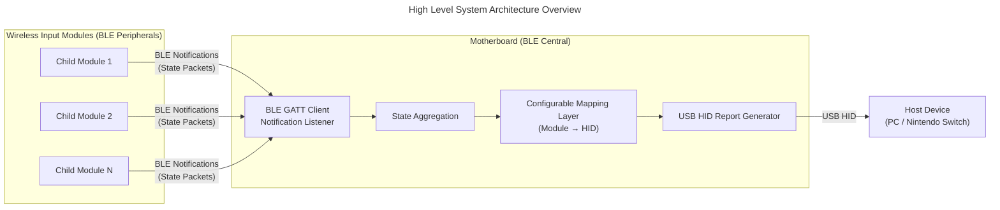

# Happy New Year!

I'm writing this blog to share some of my findings based on the work I've been doing for _OpenArcade_.
I guess I should probably share what that is as well haha.

_OpenArcade_ is the capstone project I've been working on with my team to build out a modular, accessible,
gaming controller. It's been a ton of fun diving into the systems design, firmware, and generally just building 
out a cohesive project to end off my degree. In the process of designing an accessible system, we figured
that having each "child" module be wirelessly connected to the main "mother" board felt warranted. One of 
the ways to get this done is through [BLE](https://novelbits.io/bluetooth-low-energy-ble-complete-guide/a).

We opted into BLE because it's a low latency, low powered, standardized way to stream information. Our state space 
is already quite small since we're limited by the upper bound of how many buttons are on each child module, 
and we are working with an esp32 as the chip, so it's best to limit power.

BLE has some core functionality that can be described as follows:

1. Services: "Logical grouping of data for a specific function, containing related _Characteristics_"

2. Characteristics: "The actual data points that a client reads or writes"

3. Descriptors: "Extra info (like units/metadata)"

All of these BLE services are identified by a given unique identifier, and together form the _Generic Attribute Profile_ (GATT).

This allows you to do some interesting things like sharing information on set intervals which is actually perfect
for our use case with OpenArcade. 

In the connection model for BLE, there are clients and servers, 

1. Servers: These are responsible for hosting the information clients need to access/modify.

2. Clients: These take information from the server and act on it however they are capable.

There is a huge rabbit hole to jump down for the type of messaging that is possible, but for now 
I'll just focus on detailing Notifications.

Notifications are quite similar in nature to UDP messages. Where the server broadcasting the packets
doesn't handshake on every message, this allows for the message to stream without a missed packet
stalling the system.

Now let's take a look at how we actually applied this to OpenArcade so far:

In our v1 design, we've essentially detailed a packet that looks something like this:

`States: [ Button 1 | Button 2 | ... | Button N ]`

Where the value of each entry in the packet is the state of the specific button coming straight from 
our debounced GPIO.

We are able to efficiently parse the notifications for state change and write them into our report.

There are a few expansions I plan on making to improve the robustness of the system, such as:

1. An initial handshake to define the attributes in the notifications that will follow
    - This handshake would most likely announce the capabilities of each child module to the main board
        - Number of buttons, Button Types, Analog vs Digital, etc

2. Direct integration to our configuration mapping UI 
    - Allowing users quick intuitive access to edit their controls to their preferences

This is just the first introduction I'd like to give about the project, and I'm really excited to discuss it further in future posts!

P.S. if this was at all interesting/you have any questions feel free to shoot me a message to discuss more!
